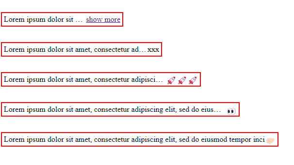

# TruncateWord

The library is about giving the ability to truncate long text dynamically by adapting to the container it is in without having to handle truncation on the code or in style sheets by entering the fixed size or limit of precise character numbers. This is also to obviate the problem of the size of devices in which the application is located.
It also offers the ability to customize text handling as well as customization of expanding dots or buttons.

## NOTE 🚨🚨🚨 
_This library is compatible with only angular were have standalone API. From 14.x.x version of Angular._

## Installation

```bash
npm i truncate-word
```

# Demo
Click here for demo online 👉🏻 [Stackblitz](https://stackblitz.com/edit/stackblitz-starters-coy8x5?file=src%2Fmain.ts)

## Implementation
Import lib component

```
import {TruncateWordComponent} from "truncate-word";
```


### If standalone component

If you work with standalone you need import the lib component on attribute imports

```
standalone: true,
imports: [TruncateWordComponent],
```

### In your file name.component.ts
Insert this code for manage the @Output event from lib component

```
showText(): void {
        window.alert(this.phrase)
    }
```

### In your file name.component.html
Insert this code in you file HTML for run the lib and try various options 🚀🚀🚀

#### Basic solution
```
<p class="p-mt">Simple container with a basic truncation with "show more" button and output for manage from
            parent where on click show alert with full text</p>
        <div class="parent-cnt" style="width: 15rem;">
            <ng-truncate-word
                    [textShow]="phrase"
                    (plusEvent)="showText()">
            </ng-truncate-word>
        </div>
```
#### Basic solution with custom button
```
        <p class="p-mt">Simple container with a basic truncation with custom button label (XXX) and output for manage
            from parent where on click show alert with full text</p>
        <div class="parent-cnt" style="width: 20rem;">
            <ng-truncate-word
                    [textShow]="phrase"
                    [customEllipsis]="'XXX'"
                    (plusEvent)="showText()">
            </ng-truncate-word>
        </div>
```
#### Basic solution with custom button as icon
```
        <p class="p-mt">Simple container with a basic truncation with custom button as icon and output for manage from
            parent where on click show alert with full text</p>
        <div class="parent-cnt" style="width: 25rem;">
            <ng-truncate-word
                    [textShow]="phrase"
                    [customEllipsis]="'🚀🚀🚀'"
                    (plusEvent)="showText()">
            </ng-truncate-word>
        </div>
```
#### Basic solution with custom button as icon and show inside parent the full text
```
        <p class="p-mt">Simple container with a basic truncation with custom button as icon and on click show with full
            text inside parent container</p>
        <div class="parent-cnt" style="width: 30rem;">
            <ng-truncate-word
                    [textShow]="phrase"
                    [customEllipsis]="'👀'"
                    [showFullTextOnClick]="true">
            </ng-truncate-word>
        </div>
```
#### Basic solution without ellipsis but with custom button as icon and show inside parent the full text
```
        <p class="p-mt">Simple container without truncation ellipsis but with custom button as icon and on click show
            with full text inside parent container</p>
        <div class="parent-cnt" style="width: 35rem;">
            <ng-truncate-word
                    [textShow]="phrase"
                    [customEllipsis]="'🤛🏻'"
                    [showFullTextOnClick]="true"
                    [disableUseEllipsis]="true">
            </ng-truncate-word>
        </div>
```

